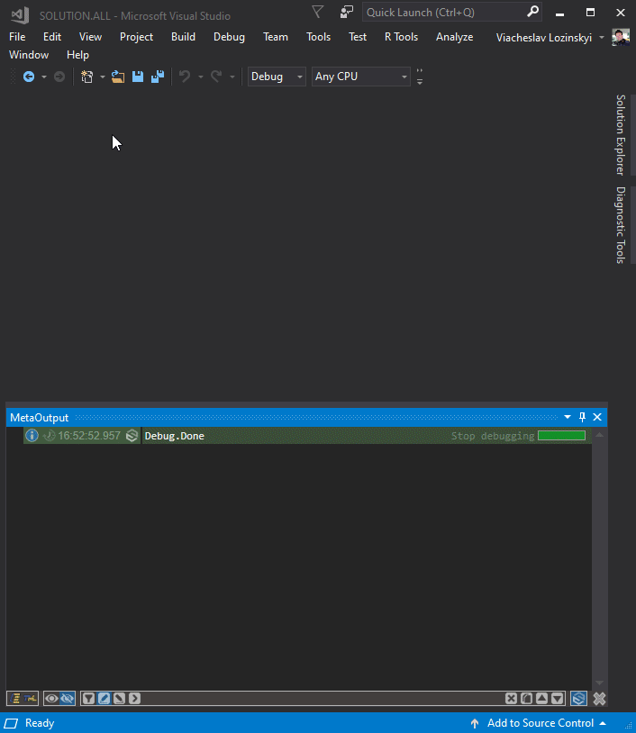

---

## This video demonstrates just tiny part of MetaOutput possibilities:

---

## This video on YouTube is official MetaOutput presentation:

- Direct link to this presentation on [YouTube](https://www.youtube.com/watch?v=_BO40nyx0Qw?autoplay=1)
- Direct link to this presentation as [PDF](https://github.com/viacheslav-lozinskyi/MetaOutput/blob/main/resource/document/MetaOutput.pdf)
- Direct link to this presentation as [PowerPoint](https://github.com/viacheslav-lozinskyi/MetaOutput/blob/main/resource/document/MetaOutput.pptx)

---

## Publications about MetaOutput:

- [Evolution of every developer's most popular tool (in Visual Studio)](https://habr.com/ru/post/458300/)

---

## Prerequisites:

- **Visual Studio** 2015, 2017, 2019, 2022
- **.NET Framework** 4.7.2+

---

## Downloads:

- Download extension for [Visual Studio 2015, 2017, 2019](https://marketplace.visualstudio.com/items?itemName=ViacheslavLozinskyi.MetaOutput-2019)
- Download extension for [Visual Studio 2022](https://marketplace.visualstudio.com/items?itemName=ViacheslavLozinskyi.MetaOutput-2022)
- Download NuGet package for [MetaOutput.Client](https://www.nuget.org/packages/MetaOutput.Client)
- Download NuGet package for [MetaOutput.Media](https://www.nuget.org/packages/MetaOutput.Media)
